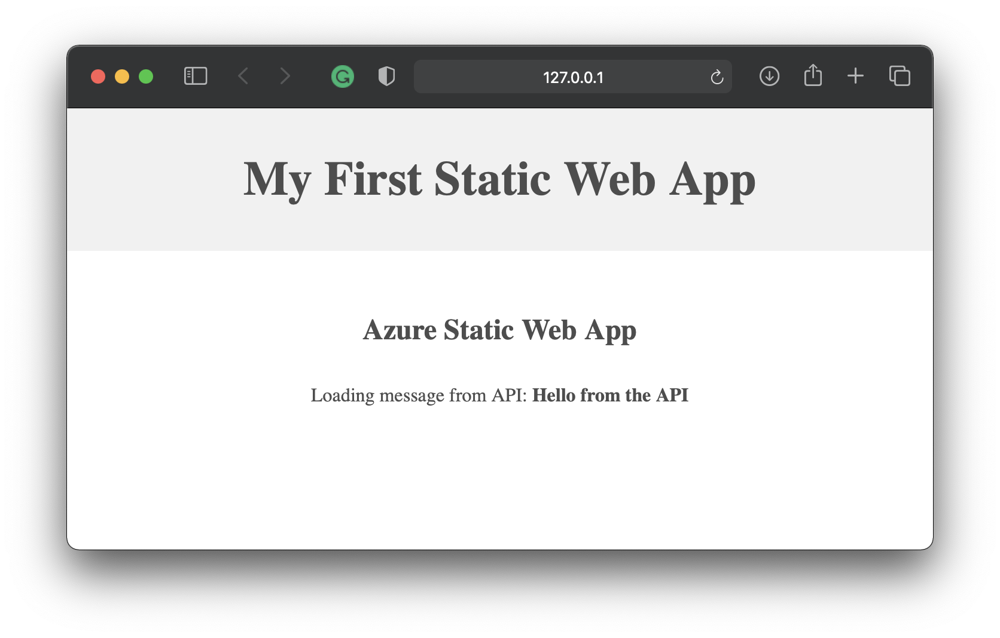

# My Static Web App
Triển khai ứng dụng Web trên dịch vụ nền tảng điện toán đám mây.
(Đây là phần thực hành của nội dung chương 4 trong học phần *Điện toán đám mây và ứng dụng* đang được giảng dạy tại Khoa Công nghệ thông tin của Trường Đại học Mỏ - Địa chất)

## Giới thiệu
**Azure Static Web Apps** là một dịch vụ nền tảng điện toán đám mây của Microsoft cho phép chúng ta xây dựng các ứng dụng web hiện đại, tự động xuất bản từ những thay đổi được thực hiện ngay trong **GitHub Actions**.

Trong bài viết này, tôi sẽ tiến hành xây dựng một ứng dụng web và triển khai nó theo giải pháp điện toán đám mây của **Microsoft Azure Portal**.

Đây là ứng dụng mà tôi sẽ xây dựng trong bài viết này


Nó trông thực sự rất đơn giản nhưng ứng dụng này lại được xây dựng và triển khai tự động trên dịch vụ nền tảng điện toán đám mây sử dụng GitHub Actions.

Nó có một API trả về một lời chào đơn giản nhưng không cần máy chủ như truyền thống mà nó được triển khai trên dịch vụ nền tảng điện toán đám mây của Microsoft Azure Portal và được thực hiện bởi dịch vụ Azure Static Web Apps.

Sau bài thực hành này, bạn có thể thực hiện một số điều sau đây với Azure Static Web Apps:

- Xây dựng các ứng dụng web hiện đại với các framework và thư viện JavaScript như [Angular](https://docs.microsoft.com/en-us/azure/static-web-apps/getting-started?tabs=angular), [React](https://docs.microsoft.com/en-us/azure/static-web-apps/getting-started?tabs=react), [Svelte](https://docs.microsoft.com/en-us/learn/modules/publish-app-service-static-web-app-api/), [Vue](https://docs.microsoft.com/en-us/azure/static-web-apps/getting-started?tabs=react) hoặc sử dụng [Blazor](https://dotnet.microsoft.com/apps/aspnet/web-apps/blazor) để tạo các ứng dụng WebAssembly với một back-end bằng các [Azure Functions](https://docs.microsoft.com/en-us/azure/static-web-apps/apis).

- Xuất bản các trang web tĩnh với các frameworks như [Gatsby](https://docs.microsoft.com/en-us/azure/static-web-apps/publish-gatsby), [Hugo](https://docs.microsoft.com/en-us/azure/static-web-apps/publish-hugo), [VuePress](https://docs.microsoft.com/en-us/azure/static-web-apps/publish-vuepress).

- Triển khai các ứng dụng web với các frameworks như [Next.js](https://docs.microsoft.com/en-us/azure/static-web-apps/deploy-nextjs) và [Nuxt.js](https://docs.microsoft.com/en-us/azure/static-web-apps/deploy-nuxtjs).

## Mở đầu
Azure Static Web Apps xuất bản ứng dụng web cho người dùng bằng cách xây dựng các ứng dụng từ kho quản lý và lưu trữ mã nguồn GitHub. Trong phần mở đầu này, chúng ta triển khai ứng dụng web cho Azure Static Web Apps bằng công cụ môi trường viết mã Visual Studio Code.

### Điều kiện tiên quyết
- Có tài khoản [GitHub](https://github.com/)
- Có tài khoản [Azure](https://portal.azure.com/)
- Môi trường viết mã [Visual Studio Code](https://code.visualstudio.com/)
- Phần mềm quản lý mã nguồn [Git for Windows](https://git-scm.com/downloads) hoặc [Git for macOS](https://git-scm.com/download/mac). Nếu bạn đã cài đặt Git, bạn có thể tải phiên bản phát triển mới nhất thông qua chính lệnh Git: ```git clone https://github.com/git/git```.
- [Azure Static Web Apps extension cho Visual Studio Code](https://marketplace.visualstudio.com/items?itemName=ms-azuretools.vscode-azurestaticwebapps)

